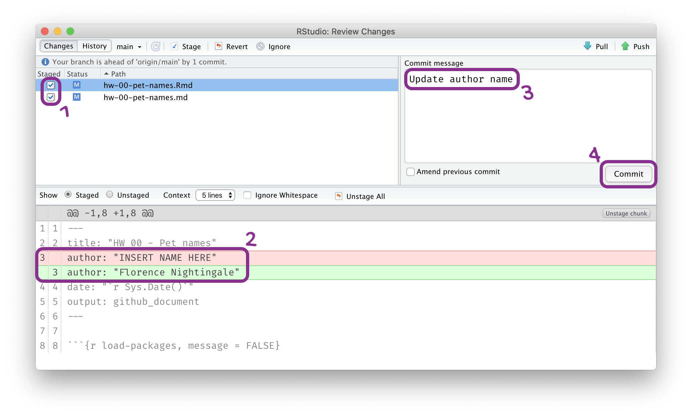

```{r include = FALSE}
knitr::opts_chunk$set(
  eval = FALSE,
  out.width = "80%",
  fig.asp = 0.618,
  fig.width = 10
)
library(tidyverse)
library(openintro)
library(ggrepel)
```

```{r photo, fig.margin = TRUE, echo = FALSE, fig.width = 8, fig.cap = "Seismogram being recorded at Weston Observatory, MA (Wikipedia)", eval = TRUE}
knitr::include_graphics("img/seismogram.jpeg")
```

The goal of this assignment is to give you more practice using R, RStudio, Git, and GitHub in combination. You'll be using the same basic workflow throughout the whole course. This time you will do an exploratory analysis of global earthquake data, using visualizations. 

# Getting started

## Terminology

We've already thrown around a few new terms, so let's define them before we proceed.

-   **R:** Name of the programming language we will be using throughout the course.

-   **RStudio:** An integrated development environment for R.
    In other words, a convenient interface for writing and running R code.

-   **Git:** A version control system.

-   **GitHub:** A web platform for hosting version controlled files and facilitating collaboration among users.

-   **Repository:** A Git repository contains all of your project's files and stores each file's revision history.
    It's common to refer to a repository as a repo.

    -   In this course, each assignment you work on will be contained in a Git repo.
    -   For individual assignments, only you will have access to the repo. For team assignments, all team members will have access to a single repo where they work collaboratively.
    -   All repos associated with this course are housed in the course GitHub organization. The organization is set up such that students can only see repos they have access to, but the course staff can see all of them.

## Starting slow

As the course progresses, you are encouraged to explore beyond what the assignments dictate; a willingness to experiment will make you a much better programmer!
Before we get to that stage, however, you need to build some basic fluency in R.
First, we will explore the fundamental building blocks of all of these tools.

Before you can get started with the analysis, you need to make sure you:

-   have a GitHub account

-   are a member of the course GitHub organization

-   are a member of the course RStudio Cloud space

# Getting Started

Each of your assignments will begin with the following steps.

**NOTE:** If you're reading this in a Knitted output, it probably means you've completed these steps already, in which case, consider this review.

**Steps to generate your own copy of the course materials for each Unit**:

-   Click on the Github repository you want to create your own copy of (e.g., `unit-1`)
-   From the repository landing page, add '/generate' to the end of the url and hit return/enter
-   Skip down to **Owner** and choose `EAES-420-Spring-24`. **Do NOT choose your own account!**
-   Under **Repository Name** enter `unit-X-yourlastname`. 
    - E.g., I would enter `unit-1-mcnicol` for Unit 1.
-   You can ignore the **Description** box.
-   Make sure your own repo is **Private**. It should be private by default.
-   Click **Create Repository** and you will be redirected to your generated repo.

**Steps to copy your generated repo into an RStudioCloud Project and open instructions**:  

-   Copy the URL of the repo you created using the green `Code` button
-   Copy/clone it into a `New Project from a GitHub Repo` in [RStudio Cloud](rstudio.cloud).
-   Navigate to the exercise, lab, or homework folder using the `File` pane.
-   Open the R Markdown instructions `lab-X-instructions.Rmd` or `hw-X-instructions.Rmd` and, Knit.

Then you work in RStudio on the data analysis, making **commits** along the way (snapshots of your changes) and finally **push** all your work back to GitHub.

The next few steps will remind you of the process of getting information of the repo to be cloned, cloning your repo in a new RStudio Cloud project, and getting started with the analysis.

### Step 1. Get URL of repo to be cloned

```{r clone-repo-link, fig.margin = TRUE, echo = FALSE, eval = TRUE}
knitr::include_graphics("img/clone-repo-link.png")
```

On GitHub, click on the green **Code** button, select **HTTPS**, then click on the clipboard icon 📋 to copy the repo URL.

### Step 2. Go to RStudio Cloud

Go to [rstudio.cloud](https://rstudio.cloud/ "RStudio Cloud") and then **navigate to the course workspace** via the left sidebar.
It's very important that you do this for two reasons:

-   To access packages I have pre-installed for you.
-   To get unlimited compute time on the RstudioCloud servers.

```{r course-workspace, fig.margin = TRUE, echo = FALSE, eval = TRUE}

```

Before you proceed, confirm that you are in the course workspace by checking out what's on your top bar in RStudio Cloud. You should see `EAES 420 Spring 2024` in blue.

### Step 3. Clone the repo

In RStudio, click on the **down arrow** next to New Project and then choose **New Project from Git Repository**.

In the pop-up window, **paste the URL** you copied from GitHub, make sure the box for **Add packages from the base project** is checked (it should be, by default) and then click **OK**.

```{r new-project-from-git, echo = FALSE, eval = TRUE, fig.align = "left"}
knitr::include_graphics("img/new-project-from-git.png")
```

# Hello RStudio!

Let's remind ourselves of the RStudio working environment.

RStudio is comprised of four panes.

```{r rstudio-anatomy, fig.fullwidth=TRUE, echo = FALSE, eval = TRUE}
knitr::include_graphics("img/rstudio-anatomy.png")
```

-   On the bottom left is the **Console** where you can write and execute code immediately. Try typing `2 + 2` here and hit enter, what do you get?
-   On the bottom right is the **Files** pane, as well as other panes that will come handy as we start our analysis.
-   If you click on a file, it will open in the **Editor**, on the top left pane.
-   Finally, the top right pane shows your **Environment**. If you define a variable it would show up there.  
    - Try typing `x <- 2` in the Console and hit enter. What do you get in the **Environment** pane?
    - Notice that this pane is also where the **Git** interface lives. We will be using that regularly throughout this assignment.

# Warm up

Before we introduce the data, let's warm up with some simple exercises.

```{marginfigure}
The top portion of your R Markdown file (between the three dashed lines) is called **YAML**. It stands for "YAML Ain't Markup Language". It is a human friendly data serialization standard for all programming languages. All you need to know is that this area is called the YAML (we will refer to it as such) and that it contains meta information about your document.
```

## Step 1. Update the YAML

Open the R Markdown (Rmd) starter file in your week-1 materials, and change the author name to your name, and knit the document.

```{r yaml-raw-to-rendered, echo = FALSE, eval = TRUE, fig.align = "center"}

```

## Step 2: Commit

Then go to the **Git tab** in your RStudio Editor pane.

You should see that your `.Rmd` (R Markdown) file and its output, your `.md` file (Markdown), file are listed next to a small Ⓜ️ symbol, meaning the file has been *modified*.  

Next, click on **Diff**.  

This will pop open a new window. You'll see the same list of files, now in the top-left pane. Highlight the file you've changed by clicking on it (`hw-01-starter.Rmd`). 

Now in the pane below you should see the **diff**erences between the original Rmd and its current (modified) state, that includes your changes. Do you notice the line numbers to the left? That shows you exactly which lines of the Rmd you changed. Additions show in green, and deletions in red.

If you're happy with these changes, click on `Staged` checkbox to the left of the filename `hw-01-starter.Rmd`, and type *"Updated author name"* in the **Commit message** box to the top-right, and finally hit **Commit**.

```{r update-author-name-commit, echo = FALSE, eval = TRUE, fig.align = "left"}

```

You don't have to commit after every change, this would get quite cumbersome.  

You should consider committing states that are *meaningful to you* for inspection, comparison, or restoration.  

In the first few assignments we will tell you exactly when to commit and in some cases, what commit message to use.  

As the semester progresses we will let you make these decisions.

## Step 3. Push

Now that you have made an update to the Rmd and committed this change, it's time to push these changes to the web! Or more specifically, to your repo on GitHub.  

You might be thinking, *Wait, didn't I just do that?* The answer is, not yet!

When you **Commit**, you are saving a version of your work in the underlying software `git`. 

When you **Push**, you're pushing those changes back to the `Github` repo you cloned everything from. 
In other words, we (your instructors) can't see your work until you **Push** it back to your repo.

So always remember to **Push** your changes after you **Commit** them!

```{r ready-to-push, fig.margin = TRUE, echo = FALSE, eval = TRUE}
knitr::include_graphics("img/ready-to-push.png")
```

When you **Push**, it will open a dialogue box where you will first need to enter your user name, and then your Github Personal Access Token (PAT).

# Packages

R is an open-source language, and developers contribute functionality to R via packages.
In this assignment we will use the following packages:

-   **tidyverse**: a collection of packages for doing data analysis in a "tidy" way
-   **openintro**: a package that contains the datasets from OpenIntro resources

We use the `library()` function to load packages.  

In your R Markdown document you should see an R chunk labelled `load-packages` (identical to the one below) which has the necessary code for loading both packages.  

```{r load-packages, echo = F, message = F}
library(tidyverse)
library(openintro)
```

Run it (in the starter file!) by clicking the **Run Current Chunk** icon (green arrow pointing right icon).

```{r load-packages-chunk, echo = FALSE, eval = TRUE, fig.align = "left"}
knitr::include_graphics("img/load-packages-chunk.png")
```

Note that these packages are also get loaded in your R Markdown environment when you **Knit** your R Markdown document.

# Earthquake Data

The World Almanac and Book of Facts (2011) has compiled records of notable earthquakes in the 20th century (1900-1999).  

For each earthquake, we have information on the `date`, `strength`, `location`, and `death toll`.  

The data used in this exercise can be found in the **openintro** package, and it's called `earthquakes`.  

Since the dataset is distributed with the package, we don't need to load it separately; it became available to you when you ran the last chunk to load the packages. 

To check this, first, notice that there is no object called `earthquakes` in your **Environment** pane at the top-right of RStudioCloud. Then, try typing earthquakes directly into the console and hitting enter. Does it return a data object?

## Viewing the data first

You can also view the `earthquakes` dataset as a spreadsheet using the `View()` function.  

Use the Console again, but this time type `View(Earthquakes)`. See what happens.

```{r data.viewer, echo = FALSE, eval = TRUE, fig.align = "left"}
knitr::include_graphics("img/view-data.png")
```

You can also find out more about the dataset by inspecting its help page with `?earthquakes` or using the Help menu in RStudio to search for `earthquakes`.. The help page contains a **data dictionary**, which gives name of each variable and its description.

# Exercises

1.  According to the data dictionary, how many earthquakes (observations) are included in this dataset?

🧶 ✅ ⬆️ *Write your answer in your R Markdown document under Exercise 1, knit the document, commit your changes with a commit message that says "Completed Exercise 1", and push. Make sure to commit and push all changed files so that your Git pane is cleared up afterwards.*

### End of Exercise 1

2.  Again, according to the data dictionary, how many variables do we have for each earthquake?

🧶 ✅ ⬆️ *Write your answer in your R Markdown document under Exercise 1, knit the document, commit your changes with a commit message that says "Completed Exercise 2", and push. Make sure to commit and push all changed files so that your Git pane is cleared up afterwards.*

### End of Exercise 2

3.  Which countries experienced the most notable earthquakes in the 20th century?  

To do this:  

- Copy the code chunk below into your starter file.  
    - This chunk counts the number of times each `region` appears in the dataset, and displays the results in descending order.
- Which are the three most earthquake-prone regions?

```{r earthquake-frequency}
earthquakes %>%
  count(region, sort = TRUE)
```

```{marginfigure}
These two lines of code can be read as "Starting with the earthquakes data frame, count the regions, and display the results sorted in descending order. 
```

🧶 ✅ ⬆️ *Complete your answer in your R Markdown starter document under Exercise 3. Then, commit your changes with a commit message that says "Completed Exercise 3", and push. Make sure to commit and push all changed files so that your Git pane is cleared up afterwards.*

### End of Exercise 3

# Zooming in

Let's use a different variable to see which `areas` are most frequently affected by earthquakes. `areas` provides a more specific location, such as a city name.  

The code chunk below does this this we need to first `group_by()` the `area`, and then do the same counting we did before.

```{marginfigure}
It looks like eastern Turkey was hit by several notable earthquakes...
```

```{r area-frequencies, eval=TRUE}
earthquakes %>% 
  group_by(area) %>%
  count(region, sort = TRUE)
```

We can also look to see which months appear most frequently in the dataset. The code chunk below does this. What do you think `sort = TRUE` is doing?

```{r earthquakes, eval=TRUE}
earthquakes %>% 
  count(month, sort = TRUE)
```

What if we just wanted to look at the three months with the most earthquakes? 

To do this, we can use a new function called `slice_max()`, added as the last line in the chunk below:

```{r earthquakes-top3, eval=TRUE}
earthquakes %>% 
  count(month) %>% 
  slice_max(n, n = 3) 
```

Let's unpack this code:

We start with the `earthquakes` data object, and send it into the `count()` function, which outputs table with the number of times `n` that each `month` appears in the dataset. We don't need to sort the output this time, because `slice_max()` does that for us.

Then we send this table into `slice_max()`. The first argument in the function is the variable we want to sort the data on (`n` - the number of times a month appears), and the second argument is the number of rows we want to output (here, `n = 3` means: output the top 3 rows of the sorted data).  

By chance in this example, the variable we want to sort by `n`, has the same name as the argument name for the number of rows `n =`. This normally is not the case.  

Look a the code chunk below and see if you can follow what it's doing:

```{r earthquakes-rename-top3, eval=TRUE}
earthquakes %>% 
  count(month) %>% 
  rename(n_of_earthquakes = n) %>% 
  slice_max(n_of_earthquakes, n = 3) 
```

There's something else that is a bit surprising about that output. Do you see it?  

Notice that `slice_max()` returns 4 rows, even though we only asked for 3. This is because there were two months that had an equal number of earthquakes (`August` and `December`).  

## Earthquakes by magnitude

This time let's search for the top 5 most common earthquake intensities using the `count()` and `slice_max()` functions.  

Remember that earthquake magnitude is expressed on the Richter scale so we can use the variable `richter` in this dataset.

```{r earthquakes-top5, eval=TRUE}
earthquakes %>% 
  count(richter) %>% 
  slice_max(n, n = 5) 
```

4.  Based on the previous output we can easily identify the most common intensities for notable earthquakes in the 20th century, but the output is sorted by `n` (the frequencies) as opposed to being organized by `richter`.  
- Build on the pipeline to arrange the results so that they're arranged by `richter`.  
    - This means you will need to add one more line to the pipeline containing only `arrange()`.

🧶 ✅ ⬆️ *Complete your answer in your R Markdown document under Exercise 4. Then, commit your changes with a commit message that says "Completed Exercise 4", and push. Make sure to commit and push all changed files so that your Git pane is cleared up afterwards.*

### End of Exercise 4

# Visualizing and Interpreting the `earthquakes` dataset

The following visualization plots the `richter` magnitude of earthquakes versus the `year`, showing a time series plot.  

The straight red line on the plot is the average magnitude over the century equal to a value of `r mean(earthquakes$richter)`.

```{r richter-year, eval = TRUE, echo = FALSE, warning = FALSE, fig.fullwidth = TRUE}
ggplot(earthquakes, aes(x = year, y = richter)) +
  geom_text_repel(aes(label = region), 
                  segment.color = COL["gray","full"], 
                  seed = 291252, max.iter = 10000) +
  geom_hline(yintercept = mean(earthquakes$richter), alpha = 0.5, color = "red") +
  geom_point(color = COL["blue","full"], alpha = 0.8) +
  theme_minimal() +
  labs(x = "Year", y = "Earthquake magnitude") +
  xlim(1900, 1999) +
  ylim(1,10) 
```

5.  Consider the **association** (if any) between magnitude (y) and year (x).  

- Does the association between the two variables seem to be positive, negative, or no relationship? 
- What does this mean in context of the data?

### End of Exercise 5

The next visualization plots the death toll (`deaths`) of earthquakes versus the `year`, showing another time series plot.

```{r deaths-year, eval = TRUE, echo = FALSE, warning = FALSE, fig.fullwidth = TRUE}
ggplot(earthquakes, aes(x = year, y = deaths)) +
  geom_text_repel(aes(label = region), 
                  segment.color = COL["gray","full"], 
                  seed = 291252, max.iter = 10000) +
  geom_point(color = COL["blue","full"], alpha = 0.8) +
  theme_minimal() +
  labs(x = "Year", y = "Death Toll") +
  xlim(1900, 1999) +
  ylim(10, 700000) 
```

6.  Consider the **association** (if any) between deaths (y) and year (x).  

- Do you think it is likely that the death toll can be predicted simply by the magnitude of the earthquake?

### End of Exercise 6

The final visualization plots the death toll (`deaths`) of earthquakes versus the `richter` magnitude, showing a scatter plot.

```{r deaths-richter, eval = TRUE, echo = FALSE, warning = FALSE, fig.fullwidth = TRUE}
# create viz
ggplot(earthquakes, aes(x = richter, y = deaths)) +
  geom_text_repel(aes(label = region), 
                  segment.color = COL["gray","full"], 
                  seed = 291252, max.iter = 10000) +
  geom_point(color = COL["blue","full"], alpha = 0.8) +
  theme_minimal() +
  labs(x = "Earthquake magnitude", y = "Death Toll") +
  xlim(5, 10) +
  ylim(10, 700000) 
```

7.  Consider the **association** (if any) between deaths (y) and richter (x).  

- Does this final visualization give you more or less confidence in your last response about the relationship between earthquake magnitude and death toll?

🧶 ✅ ⬆️ *Good job! You're finished! Commit and push your starter Rmd. Make sure that your last push to the repo comes before the deadline. You should confirm that what you committed and pushed are indeed in your repo that we will see by visiting your repo on GitHub.*