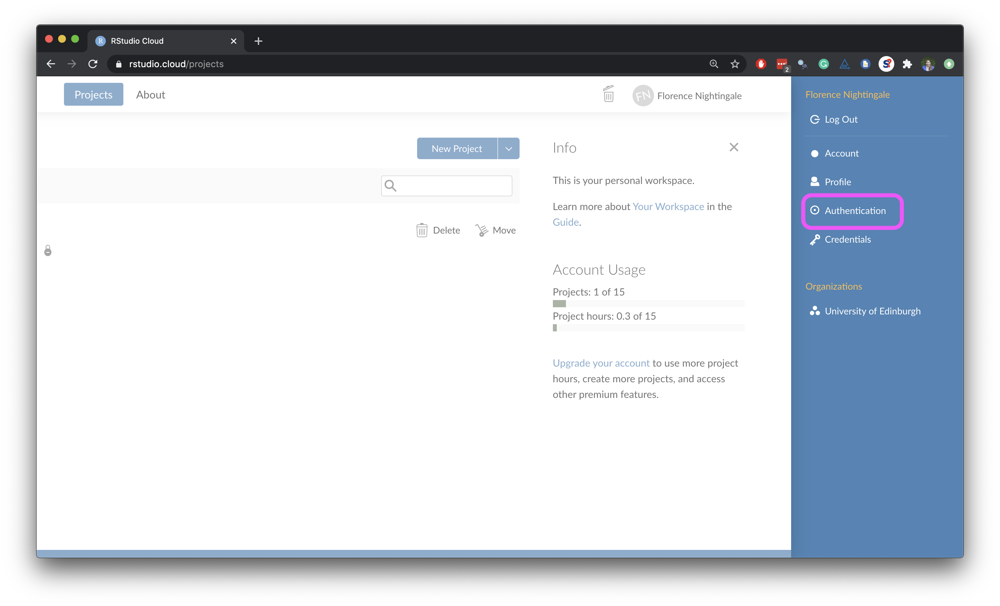
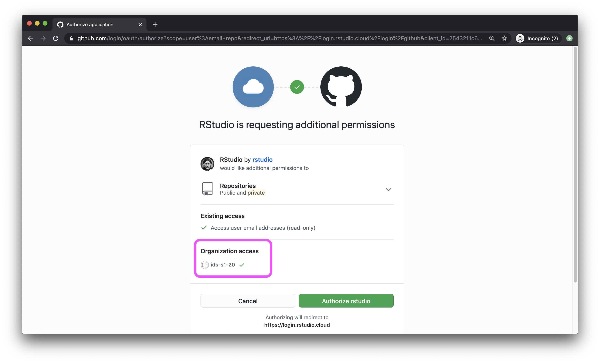
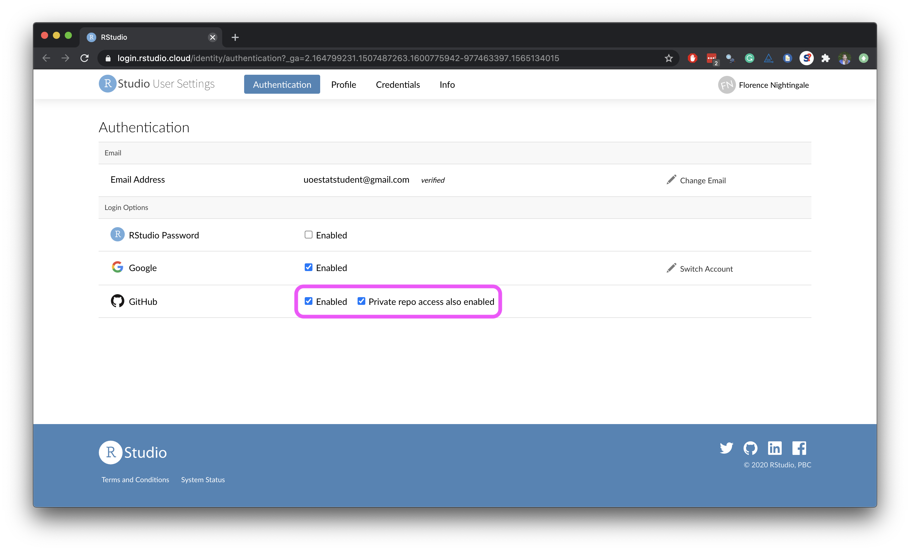

```{marginfigure}
R is the name of the programming language itself and RStudio is a convenient interface.
```

The main goal of this lab is to introduce you to **R** and **RStudio**, which we will be using throughout the course to code and analyze data.

```{marginfigure}
git is a version control system (like "Track Changes" features from Microsoft Word on steroids) and GitHub is the home for your Git-based projects on the internet (like DropBox but much, much better).
```

A second goal is to introduce you to **Git** and **GitHub**, which is the collaboration and version control system that we will be using throughout the course.

A third and final goal is to reinforce the main lesson from lecture: **that data visualization is important!**

I encourage you to explore beyond what the labs require you do; experimenting will make you a much better programmer.  

Today we begin with the fundamental building blocks of R and RStudio:  

- the interface
- reading in data
- basic R commands

# Connecting GitHub and RStudio Cloud

**Note**: We have probably already done this in class. If so, you can skip this section.

You should have already received an email invitation to join the GitHub organization for this course. 

You need to accept the invitation before moving on to the next step.

To connect your RStudio and GitHub accounts by following the steps below:

-   Click on your name on the top right corner to open the right menu.
-   Then, click on Authentication.

```{r github-auth-1, echo = FALSE}

```

-   In the Authentication window, check the box for *Enabled*.

```{r github-auth-2, echo = FALSE}

```

-   In the next window, click on the green box that says "Authorize rstudio".

```{r github-auth-3, echo = FALSE}

```

-   Back in the Authentication window, check the box for *Private repo access also enabled*, and once again, on the green box that says "Authorize rstudio" in the next window. At this point you should also make sure that the course organization shows up for you under *Organization access*. If it does not, this means you have not yet accepted the GitHub invitation to join the course, and you should go back and do that.

```{r github-auth-4, echo = FALSE}

```

-   Once you're done, both of these boxes should be checked.

```{r github-auth-5, echo = FALSE}

```

-   To confirm that you've successfully linked up your GitHub and RStudio Cloud accounts, [GitHub settings \> Applications](https://github.com/settings/applications). You should see RStudio listed as an authorized app under *Authorized OAuth Apps*. If you don't this is a good time to ask a question.

```{r github-auth-6, echo = FALSE}

```

# Getting Started

Each of your assignments will begin with the following steps.

**NOTE:** If you're reading this in a Knitted output, it probably means you've completed these steps already, in which case, consider this review.

**Steps to generate your own copy of the course materials for each Unit**:

-   Click on the Github repository you want to create your own copy of (e.g., `unit-1`)
-   From the repository landing page, add '/generate' to the end of the url and hit return/enter
-   Skip down to **Owner** and choose `EAES-420-Spring-24`. **Do NOT choose your own account!**
-   Under **Repository Name** enter `unit-X-yourlastname`. 
    - E.g., I would enter `unit-1-mcnicol` for Unit 1.
-   You can ignore the **Description** box.
-   Make sure your own repo is **Private**. It should be private by default.
-   Click **Create Repository** and you will be redirected to your generated repo.

**Steps to copy your generated repo into an RStudioCloud Project and open instructions**:  

-   Copy the URL of the repo you created using the green `Code` button
-   Copy/clone it into a `New Project from a GitHub Repo` in [RStudio Cloud](rstudio.cloud).
-   Navigate to the exercise, lab, or homework folder using the `File` pane.
-   Open the R Markdown instructions `lab-X-instructions.Rmd` or `hw-X-instructions.Rmd` and, Knit.

## Warm up

Before we introduce the data, let's warm up with some simple exercises.

```{marginfigure}
The top portion of your R Markdown file (between the three dashed lines) is called YAML. It stands for "YAML Ain't Markup Language". It is a human friendly data serialization standard for all programming languages. All you need to know is that this area is called the YAML (we will refer to it as such) and that it contains meta information about your document.
```

### YAML

Open the starter file named `lab-01-starter.Rmd` in your project directory.  

Change the author name to your name, change the date, and knit the document.  

**The starter file is where you will make ALL of your code and text edits. You will NOT need to make any edits to the instructions files throughout the course.** (Unless you are fixing one of my typos ;) )

```{r yaml-raw-to-rendered, fig.fullwidth=TRUE, echo = FALSE}

```

### Committing changes

Then go to the Git pane in your RStudio.

If you have made changes to your `.Rmd` file, you should see the file listed here.  

Click on it to select it in this list and then click on **Diff**.  

This shows you the *difference* between the last committed state of the document and its current state that includes your changes.  

If you're happy with these changes, write "Update author name" in the **Commit message** box and hit **Commit**.

```{r update-author-name-commit, fig.fullwidth=TRUE, echo = FALSE}

```

**Advice on When to Commit:** You don't have to commit after every change! You should consider committing states that are *meaningful to you* for inspection, comparison, or restoration.  

In the first few assignments we will tell you exactly when to commit and, in some cases, what commit message to use. As the semester progresses we will let you make these decisions.

### Pushing changes

Now that you have made an update and committed this change, it's time to push these changes to the web! Or more specifically, to your private repo on our class GitHub organization (`EAES-420-Spring-24`).  

**Why?** Because it lets us - "your instructors" - see your changes and grade your work. Don't worry, your repo is *not* visible to your classmates!  

**How?** In order to push your changes to GitHub, click on **Push**. This will prompt a dialogue box where you first need to enter your user name, and then your Github PAT (personal access token - just a fancy password).

## Packages

In this lab we will work with two packages:  

- **datasauRus**: containing the shapes (x-y plot data) we'll be using
- **tidyverse**: a collection of packages for doing data analysis. 
  
These packages are already **installed** for you. However, you still need to **load** them, to make them active in your session.

To **load** the packages, navigate to your `lab-01-starter.Rmd` window (where you just updated the YAML) and click the green play button at the top-right of the first code chunk below the YAML. 

This green "play" button is called the **Run Current Chunk** button. You will use it a lot. :)

```{r load-packages, message=FALSE}
library(tidyverse) # loads the tidyverse package
library(datasauRus) # loads the datasauRus package
datasaurus_dozen <- datasaurus_dozen %>% # don't worry about these last two lines
  rename(shape = dataset)
```

## Data

This lab is designed to show you why data visualization is important and how summary statistics alone can be misleading.  

The data we will be working with today is called `datasaurus_dozen` and it an object stored in the `datasauRus` package. `datasaurus_dozen` contains x and y coordinates for 13 shapes. The summary statistics for each of these shapes are the same, but the shapes look very different.   
  
To find out more about `datasaurus_dozen`, navigate to your starter file, and replace the text in the `demo-code-chunk` with:  

`?datasaurus_dozen`  

Push the **Run Current Chunk** button to open the help file.

```{marginfigure}
A question mark `?` before the name of an object will always bring up its help file.
```


# Exercises

The following exercises will guide you through an exploration of the `datasaurus_dozen` dataset and help show you why data visualization is important.  

For each exercise, **read** the exercise prompt in the `lab-01-instructions.Rmd` or knitted output file, then **write** your code and/or text answer in the `lab-01-starter.Rmd`, under the appropriate exercise.

**NOTE:** Most exercises contain more than one element/question, denoted by a bullet point. Make sure you respond to every bullet point in your starter file before moving onto the next exercise.

1.  Based on the **help** file:  

- How many rows and how many columns does the `datasaurus_dozen` file have? 
- What are the variables included in the data frame? 

### End of Exercise 1

OK, now let's take a look at what these datasets are.  

To do so we can make a *frequency table* of the shape variable:

```{r}
datasaurus_dozen %>%
  count(shape) %>%
  print(13)
```

```{marginfigure}
Matejka, Justin, and George Fitzmaurice. "Same stats, different graphs: Generating datasets with varied appearance and identical statistics through simulated annealing." Proceedings of the 2017 CHI Conference on Human Factors in Computing Systems. ACM, 2017.
```

The original Datasaurus (`dino`) was created by Alberto Cairo in [this great blog post](http://www.thefunctionalart.com/2016/08/download-datasaurus-never-trust-summary.html).  

The other datasets (`star`, `away`, `circle`, etc.) were generated using a method called simulated annealing and the process is described in the paper *Same Stats, Different Graphs: Generating Datasets with Varied Appearance and Identical Statistics* through Simulated Annealing by Justin Matejka and George Fitzmaurice. In the paper, the authors simulate a variety of datasets that have the same summary statistics as the `dino`, but have very different visual distributions (shapes).

🧶 ✅ ⬆️ *Knit, commit, and push your changes to GitHub with the commit message "Added answer for Ex 1". Make sure to commit and push all changed files so that your Git pane is cleared up afterwards.*

2.  In this exercise, you will run two R code chunks provided below **and** in your starter file to:

- Create a scatter plot of `y` vs. `x` for the `dino` shape
- Calculate the correlation coefficient between `x` and `y` for the `dino` shape

*Note:* For this exercise, you don't need to add any code in your starter file, just follow along.

Before we can plot the data in the `dino` shape, we need to filter out the other shapes in the dataset, leaving just the `dino` dataset. The code chunk below does this:

```{r filter-for-dino}
dino_data <- datasaurus_dozen %>%
  filter(shape == "dino")
```

Let's break down this code:  

First, the pipe operator, `%>%`, takes what comes before it and sends it as the first argument to what comes after it. So here, we're saying `filter` the `datasaurus_dozen` data frame for observations where `shape == "dino"`.

Second, the assignment operator: `<-`, assigns the name `dino_data` to the filtered data frame.

Next, let's take a look at what variables the `dino` dataset contains. The code chunk below does this:

```{r look-at-dino-head}
head(dino_data)
```

Let's break down this code:

This code chunk contains a single function `head()` which returns the first few rows of a dataset, as well as the column (variable) names. Do you see that there are three variables: `shape`, `x` and `y`?

OK, now finally, lets visualize these data. The code chunk below does this:

```{r plot-dino, fig.fullwidth=TRUE}
ggplot(data = dino_data, mapping = aes(x = x, y = y)) +
  geom_point()
```

Let's break this chunk down:

We use the `ggplot()` function for plotting.  

The first argument (`data = `) specifies the data object you're visualizing.  

Next we define the `aes`thetic mappings.  

In other words, we define which columns of the dataset get mapped to certain aesthetic features of the plot. In our example, the `x` axis will show data from the variable called `x` and the `y` axis will show data from the variable called `y`.  

Then, in the last line of the chunk above, we add a layer to this plot where we define which `geom`etric shapes we want to use to represent each observation in the data. In this case we want these to be points, hence `geom_point()`.

If this seems like a lot right now, it is.

But don't worry! You will learn more about building data visualizations with layers in detail next week. For now, keep following along with the code that is provided.

# Summary Statistics: Correlation Coefficient

For the second part of these exercises, we need to calculate a summary statistic: the correlation coefficient.  
Correlation coefficients, often referred to with the letter $r$ in statistics, measures the linear (straight-line) association between two variables.  

You will see in the visualizations that some of the pairs of variables we plot **do not** have a linear relationship between them.  

This is exactly why we want to visualize first: visualize to assess the form of the relationship, and calculate $r$ only if it seems useful to do so.  

In this case, calculating a correlation coefficient really doesn't make sense since the relationship between `x` and `y` is definitely not linear -- it's dinosaurial! 🦖

But, to demonstrate this, let's calculate the correlation coefficient between `x` and `y`.

```{marginfigure}
Start with `dino_data` and calculate a summary statistic that we will call `r` as the `cor`relation between `x` and `y`.
```

```{r dino-cor}
dino_data %>%
  summarize(r = cor(x, y))
```

Just a reminder: You do not need to write any code or text for Exercise 2. Just make sure you understand the text above, run the code chunks, and view the output.

### End of Exercise 2

🧶 ✅ ⬆️ *Knit, commit, and push your changes to GitHub with the commit message "Added answer for Ex 2". Make sure to commit and push all changed files so that your Git pane is cleared up afterwards.*

3.  Plot `y` vs. `x` for the `star` shape.  

- You should reuse (copy and paste) the code chunks we introduced above, just replace the shape name with the desired shape.
- Then, calculate the correlation coefficient between `x` and `y` for this shape. 
- How does this value compare to the `r` of `dino`?

### End of Exercise 3

🧶 ✅ ⬆️ *This is another good place to pause, knit, commit changes with the commit message "Added answer for Ex 3", and push. Make sure to commit and push all changed files so that your Git pane is cleared up afterwards.*

4.  Plot `y` vs. `x` for the `circle` shape.  

- You should reuse (copy and paste) the code chunks we introduced above, just replace the shape name with the desired shape.
- Then, calculate the correlation coefficient between `x` and `y` for this shape. 
- How does this value compare to the `r` of `dino`?

### End of Exercise 4

🧶 ✅ ⬆️ *You should pause again, commit changes with the commit message "Added answer for Ex 4", and push. Make sure to commit and push all changed files so that your Git pane is cleared up afterwards.*

```{marginfigure}
Facet by the shape variable, placing the plots in a 3-column grid, and do not add a legend.
```

5.  Finally, let's plot all shapes at once. In order to do this we will make use of faceting.  

- Simply add the code chunks below to your starter file and run them.

```{r all-viz, eval=FALSE, fig.fullwidth=TRUE}
ggplot(datasaurus_dozen, aes(x = x, y = y, color = shape))+
  geom_point()+
  facet_wrap(~ shape, ncol = 3) +
  theme(legend.position = "none")
```

And we can use the `group_by` function to generate all the summary correlation coefficients.

```{r all-r, eval=FALSE}
datasaurus_dozen %>%
  group_by(shape) %>%
  summarize(r = cor(x, y)) %>%
  print(13)
```

OK, you can see *all* of the shapes on one plot. And you can see *all* of the correlation coefficients. Does anything surprise you? Why might it be important to visualize data first, and not merely rely on descriptive statistics?

### End of Exercise 5

You're done with the data analysis exercises, but we'd like you to try doing two more things:

```{r fig-resize-global, fig.margin = TRUE, echo = FALSE, fig.width=3}
knitr::include_graphics("img/fig-resize-global.png")
```

-   **Resize your figures:**

Click on the gear icon in on top of the R Markdown document, and select "Output Options..." in the dropdown menu.  

In the pop up dialogue box go to the Figures tab and change the height and width of the figures, and hit OK when done.  

Then, knit your document and see how you like the new sizes.  

Change and knit again and again until you're happy with the figure sizes.  

Note that these values get saved in the YAML.  

```{r fig-resize-local, fig.margin = TRUE, echo = FALSE, fig.width=3}
knitr::include_graphics("img/fig-resize-local.png")
```

You can also use different figure sizes for different figures.  

To do so click on the gear icon within the chunk where you want to make a change.  

Changing the figure sizes added new options to these chunks: `fig.width` and `fig.height`.  

You can change them by defining different values directly in your R Markdown document as well.

```{r theme-highlight, fig.margin = TRUE, echo = FALSE, fig.width=3}
knitr::include_graphics("img/theme-highlight.png")
```

-   **Change the look of your report:**

Once again click on the gear icon in on top of the R Markdown document, and select "Output Options..." in the drop-down menu.  

In the General tab of the pop up dialogue box try out different Syntax highlighting and theme options.  

Hit OK and knit your document to see how it looks.  

Play around with these until you're happy with the look.

<br>

```{marginfigure}
Not sure how to use emojis on your computer? Maybe a teammate can help? Or you can ask your TA as well!
```

🧶 ✅ ⬆️ *Yay, you're done! Commit all remaining changes, use the commit message "Done with Lab 1!", and push. Make sure to commit and push all changed files so that your Git pane is cleared up afterwards. Before you wrap up the assignment, make sure all documents are updated on your GitHub repo.*
